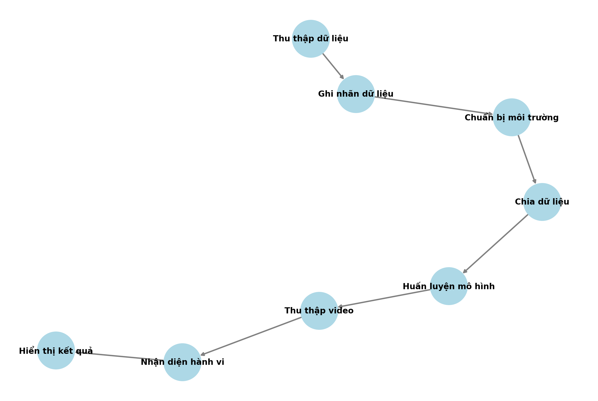

<h1 align="center">NHẬN DIỆN HÀNH VI CỦA SINH VIÊN TRONG LỚP HỌC </h1>

  

<h2 align="center">Sử Dụng Yolov7 Để Nhận Diện Hành Vi Của Sinh Viên</h2>

  Nhận diện hành vi học sinh trong lớp học sử dụng YOLOv7 là ứng dụng công nghệ AI để phát hiện hành vi như giơ tay, sử dụng điện thoại. YOLOv7 giúp nhận diện đối tượng trong ảnh/video theo thời gian thực, hỗ trợ giáo viên quản lý lớp học hiệu quả hơn. Công nghệ này giúp tăng cường sự tương tác và giám sát, nâng cao chất lượng dạy và học.

---

## 🌟 Giới thiệu
-Khi học sinh thực hiện các hành động Yolov7 sẽ nhanh chóng biết được hành động của học sinh đó là gì
-Chắc chắn rằng không thể nào đúng được 100% và cũng vẫn sẽ có lỗi xảy ra
---
## 🏗️ HỆ THỐNG

  

---
## 📂 Cấu trúc dự án

📦 Project  
├── 📂 AttendanceDB  # Thư mục chứa cơ sở dữ liệu MongoDB backup  
├── 📂 ThongBao  
│   ├── ThongBao.ino  # Mã nguồn Arduino điều khiển LED (xanh/đỏ) và còi  
├── 📂 templates  
│   ├── checkin_success.html  # Giao diện HTML thông báo điểm danh thành công  
├── chuongTrinh.py  # Chương trình chính khởi động LED service, Tkinter UI  
├── Diemdanh.py  # Giao diện quản lý lịch sử điểm danh, xuất CSV, kết nối MongoDB  
├── TaoQR.py  # Tạo mã QR, gửi email, quản lý sinh viên, Flask server xử lý điểm danh  

---

## 🛠️ CÔNG NGHỆ SỬ DỤNG

### 📡 Phần cứng

### 🖥️ Phần mềm

## 🛠️ Yêu cầu hệ thống

### 🔌 Phần cứng
- **Arduino Uno** (hoặc board tương thích) với **LED (2 màu) và còi**.
- **Cáp USB** để kết nối Arduino với máy tính.
- ⚠️ **Lưu ý:** Mặc định mã nguồn Arduino trong `ThongBao.ino` sử dụng cổng `COM5`. Nếu Arduino của bạn sử dụng cổng khác, hãy thay đổi biến `SERIAL_PORT` trong `chuongTrinh.py`.

### 💻 Phần mềm
- **🐍 Python 3+**
- **🍃 MongoDB** (kết nối mặc định: `mongodb://localhost:27017/`)
- **⚡ Arduino IDE** để nạp file `ThongBao.ino` lên board Arduino.

### 📦 Các thư viện Python cần thiết
Cài đặt các thư viện bằng lệnh:

    pip install pillow qrcode pymongo tkcalendar flask pyserial gtts pygame
## 🧮 Bảng mạch

### 🔩 Kết nối phần cứng:

### ⛓️‍💥 Hướng dẫn cắm dây
| Thiết bị        | Chân trên thiết bị | Kết nối Arduino UNO | Ghi chú                         |
|-----------------|-------------------|---------------------|---------------------------------|
| Breadboard      | -                 | -                   | Dùng để kết nối linh kiện       |
| Đèn LED xanh    | Anode (+), Cathode (-) | Anode → Digital Pin 9, Cathode → GND | Led thông báo khi sinh viên điểm danh đúng giờ|
| Đèn LED đỏ      | Anode (+), Cathode (-) | Anode → Digital Pin 10, Cathode → GND | Led thông báo khi sinh viên điểm danh muộn|
| Buzzer         | (+), (-)            | (+) → Digital Pin 11, (-) → GND |Còi thông báo khi sinh viên điểm danh muộn|
| 7 dây điện      | -                 | -                   | Dùng để nối các linh kiện       |

## 🚀 Hướng dẫn cài đặt và chạy
1️⃣ Chuẩn bị phần cứng
- **Nạp mã Arduino**:

    1. Mở file `ThongBao.ino` bằng Arduino IDE.
    2. Kết nối board Arduino với máy tính.
    3. Nạp (upload) mã nguồn lên board.
    4. Đảm bảo Arduino xuất hiện trên cổng COM5 (hoặc thay đổi trong `chuongTrinh.py` nếu cổng khác COM5).

2️⃣ Cài đặt thư viện Python. 

Cài đặt Python 3 nếu chưa có, sau đó cài đặt các thư viện cần thiết bằng pip.

3️⃣ Cấu hình MongoDB
- Cài đặt MongoDB nếu chưa có.
- Khởi động MongoDB và đảm bảo đang hoạt động tại `mongodb://localhost:27017/`.
- Khôi phục cơ sở dữ liệu từ bản sao lưu:

        mongorestore --db AttendanceDB "đường-dẫn-đến-thư-mục-AttendanceDB"
- Ví dụ:

        mongorestore --db AttendanceDB "C:\Users\LENOVO\Documents\Demo2QR\AttendanceDB"
📌 Lưu ý:
-	Tránh trùng lặp cơ sở dữ liệu: Trước khi thực hiện restore, hãy kiểm tra xem MongoDB đã có cơ sở dữ liệu tên AttendanceDB chưa. Nếu có, bạn có thể gặp lỗi hoặc dữ liệu cũ có thể bị ghi đè.
-	Đảm bảo MongoDB đang chạy: Nếu MongoDB chưa được khởi động, lệnh mongorestore sẽ không hoạt động.

4️⃣ Chạy các chương trình

Để đảm bảo hệ thống hoạt động đúng cách, bạn cần khởi chạy `chuongTrinh.py` trước, thay vì chạy từng file con riêng lẻ. File này cung cấp giao diện chính và bao gồm logic kết nối với Arduino board. Nếu chạy trực tiếp các file con, việc kết nối với Arduino sẽ không hoạt động.

✅ Chạy ứng dụng chính (`chuongTrinh.py`):

    python chuongTrinh.py
- Ứng dụng sẽ:

    - Khởi động **LED Service** tại `localhost:6000` để điều khiển LED và còi.
    - Hiển thị giao diện chính (Tkinter) với các nút: **Tạo mã QR** và **Xem điểm danh**

✅ Chạy ứng dụng quản lý điểm danh (`Diemdanh.py`):

    python Diemdanh.py

✅ Chạy ứng dụng tạo mã QR (`TaoQR.py`):

    python TaoQR.py

## 📖 Hướng dẫn sử dụng
1️⃣ Điểm danh qua QR code

- Sinh viên nhận email chứa mã QR.
- Khi quét mã, trình duyệt sẽ gửi yêu cầu điểm danh đến Flask server.
- Hệ thống kiểm tra tính hợp lệ và cập nhật vào MongoDB, đồng thời điều khiển Arduino:
    - ✅ Điểm danh đúng hạn → LED xanh.
    - ⏳ Điểm danh trễ → LED đỏ, còi, phát thông báo.
    
2️⃣ Quản lý sinh viên & mã QR
- Qua giao diện của TaoQR.py, bạn có thể:
    - Thêm, sửa, xóa thông tin sinh viên.
    - Nhập/xuất danh sách sinh viên từ/đến file CSV.
    - Tạo QR cho sinh viên theo lớp hoặc toàn bộ sinh viên.
    - Xóa mã QR cũ một cách thủ công.

3️⃣ Xem lịch sử điểm danh
- Qua giao diện của Diemdanh.py, bạn có thể:
    - Lọc danh sách điểm danh theo ngày, lớp, trạng thái.
    - Xuất dữ liệu điểm danh ra file CSV.
    - Hệ thống tự động cập nhật và chốt các phiên điểm danh.

## ⚙️ Cấu hình & Ghi chú

1. Cổng Arduino: 
- Mặc định sử dụng COM5, có thể cập nhật trong `chuongTrinh.py`.
2. Email gửi mã QR:
- Trong `TaoQR.py`, cập nhật thông tin *sender_email* và *sender_password*.(sender email là địa chỉ email gửi, sender password là mật khẩu ứng dụng của email đó.)
3. Thời gian hiệu lực mã QR: 
- Mã QR có hiệu lực 100 phút kể từ thời điểm tạo.
4. Môi trường mạng: 
- Thiết bị quét QR cần kết nối cùng mạng với máy chủ.

## 📰 Poster

  

## 🤝 Đóng góp
Dự án được phát triển bởi 4 thành viên:

| Họ và Tên       | Vai trò                  |
|-----------------|--------------------------|
| Nguyễn Nam Hưng | Phát triển toàn bộ mã nguồn, thiết kế cơ sở dữ liệu, kiểm thử, triển khai dự án và thực hiện video giới thiệu.|
| Hoàng Mạnh Linh | Biên soạn tài liệu Overleaf, Poster, Powerpoint, thuyết trình, đề xuất cải tiến, và hỗ trợ bài tập lớn.|
| Đào Đức Mạnh    | Thiết kế slide PowerPoint, hỗ trợ bài tập lớn.  |
| Cao Văn Huy     | Hỗ trợ bài tập lớn       |

© 2025 NHÓM 1, CNTT16-03, TRƯỜNG ĐẠI HỌC ĐẠI NAM
