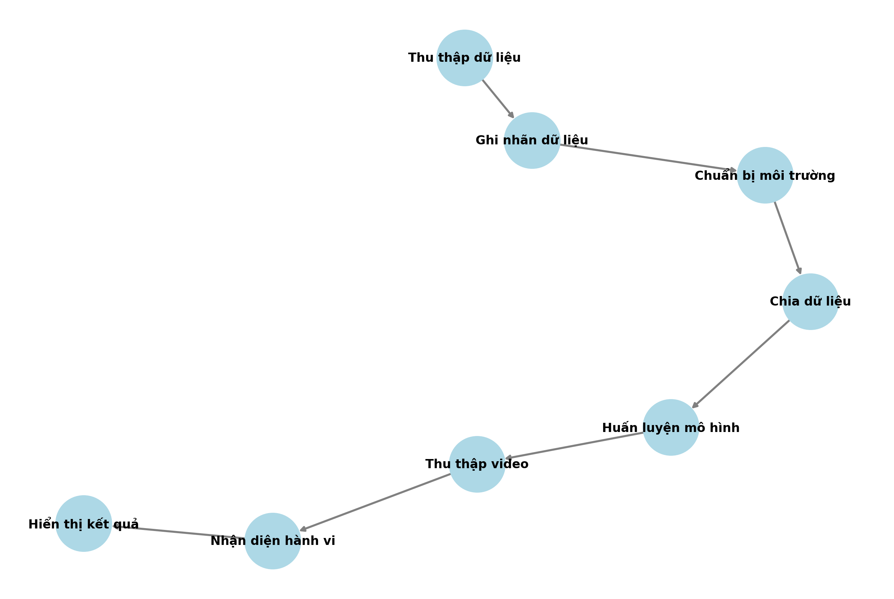

<h1 align="center">NHẬN DIỆN HÀNH VI CỦA SINH VIÊN TRONG LỚP HỌC </h1>

<div align="center">

<p align="center">
  
    
</p>

[](https://www.facebook.com/DNUAIoTLab)
[](https://fitdnu.net/)
[](https://dainam.edu.vn)
</div>

<h2 align="center">Sử Dụng Yolov7 Để Nhận Diện Hành Vi Của Sinh Viên</h2>

<p align="left">
  Nhận diện hành vi học sinh trong lớp học sử dụng YOLOv7 là ứng dụng công nghệ AI để phát hiện hành vi như giơ tay, sử dụng điện thoại. YOLOv7 giúp nhận diện đối tượng trong ảnh/video theo thời gian thực, hỗ trợ giáo viên quản lý lớp học hiệu quả hơn. Công nghệ này giúp tăng cường sự tương tác và giám sát, nâng cao chất lượng dạy và học.


</p>

---

## 🌟 Giới thiệu
-Khi học sinh thực hiện các hành động Yolov7 sẽ nhanh chóng biết được hành động của học sinh đó là gì
<br>
-Chắc chắn rằng không thể nào đúng được 100% và cũng vẫn sẽ có lỗi xảy ra
---
## 🏗️ HỆ THỐNG
<p align="center">
  
</p>

---


## 🛠️ CÔNG NGHỆ SỬ DỤNG

<div align="center">

<p align="center">
  
</p>
</div>

##  Yêu cầu hệ thống

-Có thể sử dụng Visual nếu máy đủ khoẻ 
<br>
or
<br>
-Sử dụng <a href="https://colab.google/" target="_blank">Colab</a> cho nhanh

## 🚀 Hướng dẫn cài đặt và chạy


 <h2>Bước 1: Thu thập dữ liệu</h2>
    <p>Thu thập dữ liệu video hoặc hình ảnh hành vi học sinh từ nguồn được quay bằng điện thoại.</p>
    <h2>Bước 2: Gán nhãn dữ liệu</h2>
    <p>Đánh dấu các đối tượng và hành vi (ví dụ: giơ tay, sử dụng điện thoại, v.v.) trong dữ liệu. Sử dụng dataset của bạn và của người khác nếu cần.</p>
   <p>Dataset </p> <a href="https://universe.roboflow.com/ttnt-nyz2m/ai-fxy4m/dataset/2" target="_blank">Tại Đây</a> 
    <h2>Bước 3: Upload file lên Google Drive</h2>
    <p>Để tải dữ liệu lên Google Drive, bạn có thể sử dụng giao diện web hoặc API.</p>
    <h2>Bước 4: Vào Colab để Train</h2>
    <p>Truy cập vào Google Colab để thực hiện huấn luyện mô hình YOLOv7.</p>
    <h2>Bước 5: Liên kết Colab với Google Drive</h2>
    <p>Trong Google Colab, sử dụng lệnh sau để gắn kết Google Drive:</p>
    <pre><code>from google.colab import drive
drive.mount('/content/drive')</code></pre>
    <h2>Bước 6: Tải các thư viện cần thiết</h2>
    <p>Sử dụng các lệnh sau để cài đặt các thư viện cần thiết:</p>
    <pre><code>
      
!pip install torch torchvision
!pip install matplotlib
!pip install opencv-python
!pip install wandb</code></pre>
<br>
    <h2>Bước 7: Tải mã nguồn YOLOv7</h2>
    <p>Tải mã nguồn YOLOv7 từ GitHub và chuyển đến thư mục tương ứng:</p>
    
    !git clone https://github.com/WongKinYiu/yolov7.git
    %cd yolov7
<br>
    <h2>Bước 8: Tải trọng số YOLOv7</h2>
    <p>Tải trọng số YOLOv7 từ GitHub và lưu vào thư mục thích hợp:</p>
    
    !wget https://github.com/WongKinYiu/yolov7/releases/download/v0.1/yolov7.pt -P /content/SCB-dataset/yolov7/
<br>
    <h2>Bước 9: Huấn luyện mô hình</h2>

<p>Sử dụng lệnh sau để huấn luyện mô hình YOLOv7:<p>

```bash
!python /content/yolov7/train.py \
    --data "/content/drive/MyDrive/BTL_AII/AI.v3-ai.yolov7pytorch/data.yaml" \
    --cfg "/content/yolov7/cfg/training/yolov7.yaml" \
    --weights "/content/SCB-dataset/yolov7/yolov7.pt" \
    --epochs 50 \
    --batch-size 16 \
    --img-size 640 \
    --device 0 \
    --workers 4 \
    --cache-images \
    --name Yolo7_BTL \
    --project "/content/drive/MyDrive/BTL_AII"
```

  ##  Bước 10: Nhận diện hành vi qua video</h2>
  
Chạy mô hình YOLOv7 để nhận diện hành vi trong video
    
```bash
  import subprocess
  cmd = ["python3", "/content/yolov7/detect.py", 
        "--weights", "/content/drive/MyDrive/BTL_AII/Yolo7_BTL/weights/best.pt", 
       "--source", "/content/drive/MyDrive/Capcut/1.MOV", 
       "--img-size", "640", 
       "--conf-thres", "0.1", 
       "--save-txt", "--save-conf", 
       "--project", "chạy/phát hiện", 
       "--name", "detect_output", 
       "--exist-ok"]
result = subprocess.run(cmd, capture_output=True, text=True)
print(result.stdout)
print(result.stderr)
```


## 🤝 Đóng góp
Dự án được phát triển bởi 3 thành viên:

| Họ và Tên                | Vai trò                  |
|--------------------------|--------------------------|
| Trần Anh Tú              | Phát triển toàn bộ mã nguồn,kiểm thử, triển khai dự án và thực hiện video giới thiệu,biên                              soạn tài liệu Overleaf ,Powerpoint, thuyết trình, đề xuất cải tiến.|
| Trần Thế Lộc             | Hỗ trợ bài tập lớn.|
| Phạm Đình Minh Trưởng    | Hỗ trợ bài tập lớn.  |

© 2025 NHÓM 7, CNTT 17-15, TRƯỜNG ĐẠI HỌC ĐẠI NAM
